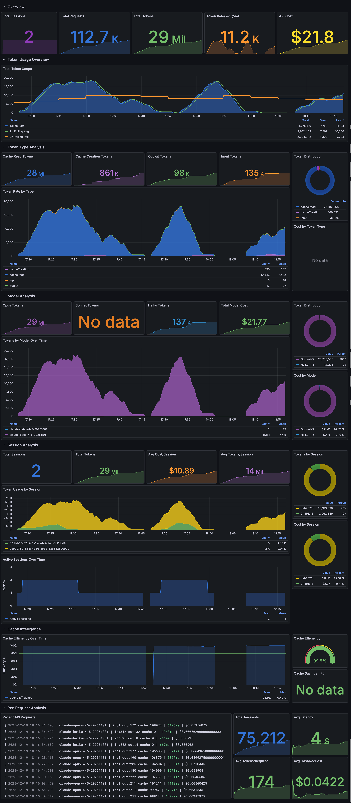

# Claude Code Observability Stack

[](https://github.com/ColeMurray/claude-code-otel)
[](LICENSE)
[](docker-compose.yml)

A comprehensive observability solution for monitoring Claude Code usage, performance, and costs. This setup implements the recommendations from the [Claude Code Observability Documentation](CLAUDE_OBSERVABILITY.md) to provide deep insights into AI-assisted development workflows.

## 📸 Dashboard Screenshots

### 📊 Claude Code Dashboard
The main operations dashboard with comprehensive visibility into sessions, costs, tool usage, performance, and real-time event logs.


*Sections: Overview stats, Cost & Usage Analysis, Tool Usage & Performance, Performance & Errors, User Activity & Productivity, Event Logs*

### 🚀 Developer Productivity Dashboard
Executive cockpit view with hero stats, activity timelines, tool breakdown, code velocity, and cost intelligence.


*Sections: Hero Stats, Activity Timeline, What Claude Did, Cost Intelligence, Live Activity*

### 🎯 Token Usage Analysis Dashboard
Deep-dive into token consumption patterns, model distribution, session analysis, and cache efficiency metrics.



*Sections: Overview, Token Usage Over Time, Model Analysis, Session Analysis, Cache Intelligence*

## 🎯 Features

### 📊 **Comprehensive Monitoring**
- **Cost Analysis**: Track usage costs by model, user, and time periods
- **User Analytics**: Daily/Weekly/Monthly Active Users (DAU/WAU/MAU)
- **Tool Usage**: Monitor which Claude Code tools are used most frequently
- **Performance Metrics**: API latency, success rates, and bottleneck identification
- **Productivity Insights**: Lines of code changes, commits, and pull requests

### 📊 **Enhanced Analytics**
- **API Request Tracking**: Monitor actual request counts by model version
- **Token Efficiency**: Track cost-per-token across different models
- **Session Analytics**: Comprehensive session and productivity tracking
- **Real-time Monitoring**: Live dashboards with 30-second refresh rates

### 📈 **Rich Dashboards**
- **Executive Overview**: High-level KPIs and trends
- **Cost Management**: Detailed cost breakdowns and projections
- **Tool Performance**: Success rates and execution times
- **User Activity**: Productivity and engagement metrics
- **Error Analysis**: Comprehensive error tracking and investigation

## 🏗️ Architecture

```
Claude Code → OpenTelemetry Collector → Prometheus (metrics) + Loki (events/logs)
                                     ↓
                              Grafana (visualization & analysis)
```

### Components

| Service | Purpose | Port | UI |
|---------|---------|------|----| 
| **OpenTelemetry Collector** | Metrics/logs ingestion | 4317 (gRPC), 4318 (HTTP) | - |
| **Prometheus** | Metrics storage & querying | 9090 | http://localhost:9090 |
| **Loki** | Log aggregation & storage | 3100 | - |
| **Grafana** | Dashboards & visualization | 3000 | http://localhost:3000 |

## 🚀 Quick Start

### 1. Start the Stack
```bash
# Start all services
make up

# Check status
make status
```

### 2. Configure Claude Code
```bash
# Enable telemetry
export CLAUDE_CODE_ENABLE_TELEMETRY=1

# Configure exporters
export OTEL_METRICS_EXPORTER=otlp
export OTEL_LOGS_EXPORTER=otlp
export OTEL_EXPORTER_OTLP_PROTOCOL=grpc
export OTEL_EXPORTER_OTLP_ENDPOINT=http://localhost:4317

# For debugging (faster export intervals)
export OTEL_METRIC_EXPORT_INTERVAL=10000
export OTEL_LOGS_EXPORT_INTERVAL=5000

# Run Claude Code
claude
```

### 3. Access Dashboards
- **Grafana**: http://localhost:3000 (admin/admin)
- **Prometheus**: http://localhost:9090

> 🖼️ **Visual Guide**: Check out the [Dashboard Screenshots](#-dashboard-screenshots) to see what your dashboards will look like!

## 📊 Available Metrics

Based on the [Claude Code Observability Documentation](CLAUDE_OBSERVABILITY.md), this stack monitors:

### Core Metrics
- `claude_code.session.count` - CLI sessions started
- `claude_code.lines_of_code.count` - Lines of code modified (added/removed)
- `claude_code.pull_request.count` - Pull requests created
- `claude_code.commit.count` - Git commits created
- `claude_code.cost.usage` - Cost of sessions by model
- `claude_code.token.usage` - Token usage (input/output/cache/creation)
- `claude_code.code_edit_tool.decision` - Tool permission decisions

### Event Data
- `claude_code.user_prompt` - User prompt submissions
- `claude_code.tool_result` - Tool execution results and timings
- `claude_code.api_request` - API requests with duration and tokens
- `claude_code.api_error` - API errors with status codes
- `claude_code.tool_decision` - Tool permission decisions

## 🔍 Usage Analysis

### Real-time Dashboard Analysis

Access comprehensive analytics through the Grafana dashboard at http://localhost:3000:

- **Cost Analysis**: Real-time cost tracking with model breakdowns
- **Request Monitoring**: API request counts and patterns by model
- **Token Efficiency**: Track token usage and cost-per-token metrics
- **Tool Performance**: Success rates and execution time analysis
- **Session Analytics**: User activity and productivity insights

### Key Metrics Available
- Total and per-model costs with trending
- API request counts independent of cost variations
- Token usage breakdown (input/output/cache/creation)
- Tool usage patterns and success rates
- Session activity and code productivity metrics

## 📊 Key Dashboard Features

> 💡 **See [Dashboard Screenshots](#-dashboard-screenshots) above for visual examples**

### 💰 Cost & Usage Analysis
- **Cost by Model**: Track spending across different Claude models
- **API Request Tracking**: Monitor actual request counts by model version  
- **Token Usage Breakdown**: Detailed analysis by token type (input/output/cache)

### 🔧 Tool Performance
- **Usage Patterns**: Most frequently used Claude Code tools
- **Success Rates**: Tool execution success percentages
- **Performance Metrics**: Average execution times and bottleneck identification

### ⚡ Real-time Monitoring
- **Live Metrics**: 30-second refresh rate for current activity
- **Session Tracking**: Active sessions and productivity metrics
- **Error Analysis**: API errors and troubleshooting information

## 📋 Available Dashboards

Three specialized dashboards are included for different analysis needs:

### 📊 Claude Code Dashboard (`claude-code-dashboard.json`)
The main operations dashboard for day-to-day monitoring:
- **Overview**: Active sessions, cost, token usage, lines of code
- **Cost & Usage Analysis**: Cost trends by model, token usage breakdown, API request tracking
- **Tool Usage & Performance**: Tool frequency, success rates, cumulative usage
- **Performance & Errors**: API latency by model, error rate tracking
- **User Activity & Productivity**: Code changes, commits, pull requests
- **Event Logs**: Real-time tool execution events and API errors

### 🚀 Developer Productivity Dashboard (`dashboards/developer-productivity.json`)
Executive cockpit for productivity insights:
- **Hero Stats**: Today's spend, tokens used, lines changed, tool calls, cache efficiency
- **Activity Timeline**: Cost and token usage over time with model breakdown
- **What Claude Did**: Top tools used, code velocity (lines added/removed)
- **Cost Intelligence**: Spending by model over time, token breakdown, cache savings
- **Live Activity**: Recent tool executions and errors

### 🎯 Token Usage Analysis (`dashboards/token-usage.json`)
Deep-dive analysis for token optimization:
- **Overview**: Total tokens, token rate, cache efficiency, estimated cost
- **Token Usage Over Time**: Rate by type, cumulative usage trends
- **Model Analysis**: Tokens by model over time, model distribution pie chart
- **Session Analysis**: Top sessions by token usage, active sessions over time
- **Cache Intelligence**: Cache efficiency over time, cache savings estimate

## 🔧 Advanced Configuration

### Environment Variables

Key configuration options (see [CLAUDE_OBSERVABILITY.md](CLAUDE_OBSERVABILITY.md) for complete reference):

```bash
# Core telemetry
CLAUDE_CODE_ENABLE_TELEMETRY=1

# Exporter configuration
OTEL_METRICS_EXPORTER=otlp,prometheus    # Multiple exporters
OTEL_LOGS_EXPORTER=otlp

# Protocol and endpoints
OTEL_EXPORTER_OTLP_PROTOCOL=grpc
OTEL_EXPORTER_OTLP_ENDPOINT=http://localhost:4317
OTEL_EXPORTER_OTLP_HEADERS="Authorization=Bearer token"

# Export intervals
OTEL_METRIC_EXPORT_INTERVAL=60000        # 1 minute (production)
OTEL_LOGS_EXPORT_INTERVAL=5000           # 5 seconds

# Privacy controls
OTEL_LOG_USER_PROMPTS=1                   # Enable prompt content logging

# Cardinality control
OTEL_METRICS_INCLUDE_SESSION_ID=true
OTEL_METRICS_INCLUDE_VERSION=false
OTEL_METRICS_INCLUDE_ACCOUNT_UUID=true
```

### Collector Configuration

The OpenTelemetry collector is configured with:
- **Processors**: Resource enrichment and event filtering
- **Multiple Pipelines**: Separate routing for metrics and different event types
- **Metric Relabeling**: Cardinality control for better performance

### Backend Considerations

Following the documentation recommendations:

- **Metrics Backend**: Prometheus (time series) + optional columnar stores
- **Events Backend**: Loki (log aggregation) with JSON parsing
- **Cardinality Management**: Configurable attribute inclusion
- **Retention**: Configure based on your analysis needs

## 🛠️ Management Commands

```bash
# Stack management
make up                    # Start all services
make down                  # Stop all services  
make restart              # Restart services
make clean                # Clean up containers and volumes

# Monitoring
make logs                 # View all logs
make logs-collector       # View collector logs only
make status              # Show service status

# Validation
make validate-config     # Validate all configs
make setup-claude       # Show Claude Code setup instructions
```

## Shell Helper Functions

Add these to your `~/.zshrc` or `~/.bashrc` for quick access to the observability stack. Set the environment variables to match your deployment (localhost or remote).

### Environment Variables

```bash
# Required: Your Grafana URL (no trailing slash)
export OTEL_GRAFANA_URL="http://localhost:3000"

# Required: Collector host (for health checks)
export OTEL_HOST="localhost"
```

### Helper Functions

```bash
# Quick check if telemetry is working
check_claude_telemetry() {
    echo "Checking Claude Code Telemetry Configuration..."
    echo ""
    echo "Telemetry Enabled: ${CLAUDE_CODE_ENABLE_TELEMETRY:-NOT SET}"
    echo "Prompt Logging:    ${OTEL_LOG_USER_PROMPTS:-NOT SET}"
    echo "Collector:         ${OTEL_EXPORTER_OTLP_ENDPOINT:-NOT SET}"
    echo "Grafana:           ${OTEL_GRAFANA_URL:-NOT SET}"
    echo ""

    if curl -s --connect-timeout 3 "http://${OTEL_HOST:-localhost}:4318" >/dev/null 2>&1; then
        echo "Collector is reachable at ${OTEL_HOST:-localhost}:4317"
    else
        echo "Cannot reach collector at ${OTEL_HOST:-localhost}:4317"
    fi
}

# View recent Claude Code logs in Loki via Grafana Explore
#
# IMPORTANT: This queries Loki (not Prometheus). Logs use the stream label
# service_name (not job). All event attributes (tool_name, event_name, etc.)
# are Loki structured metadata and must be accessed via pipeline filters,
# not stream selectors. See CLAUDE.md for LogQL query patterns.
claude_logs() {
    local minutes=${1:-30}
    echo "Opening Grafana Explore with Loki (last ${minutes} minutes)..."
    # Grafana Explore URL with Loki datasource and correct LogQL query
    # Decoded panes JSON: {"logs":{"datasource":"loki","queries":[{"refId":"A","expr":"{service_name=~\"claude-code.*\"}","queryType":"range"}],"range":{"from":"now-<minutes>m","to":"now"}}}
    open "${OTEL_GRAFANA_URL}/explore?schemaVersion=1&panes=%7B%22logs%22%3A%7B%22datasource%22%3A%22loki%22%2C%22queries%22%3A%5B%7B%22refId%22%3A%22A%22%2C%22expr%22%3A%22%7Bservice_name%3D~%5C%22claude-code.%2A%5C%22%7D%22%2C%22queryType%22%3A%22range%22%7D%5D%2C%22range%22%3A%7B%22from%22%3A%22now-${minutes}m%22%2C%22to%22%3A%22now%22%7D%7D%7D"
}

# Open the Claude Code dashboard
claude_dash() {
    echo "Opening Claude Code dashboard..."
    open "${OTEL_GRAFANA_URL}/d/claude-code?refresh=30s"
}

# Open Prometheus metrics explorer
claude_metrics() {
    echo "Opening Grafana Explore with Prometheus..."
    open "${OTEL_GRAFANA_URL}/explore?schemaVersion=1&panes=%7B%22metrics%22%3A%7B%22datasource%22%3A%22prometheus%22%2C%22queries%22%3A%5B%7B%22refId%22%3A%22A%22%2C%22expr%22%3A%22%7B__name__%3D~%5C%22claude_code.%2A%5C%22%7D%22%7D%5D%2C%22range%22%3A%7B%22from%22%3A%22now-1h%22%2C%22to%22%3A%22now%22%7D%7D%7D"
}
```

### Aliases

```bash
alias claude-check='check_claude_telemetry'
alias claude-logs='claude_logs'
alias claude-dash='claude_dash'
alias claude-metrics='claude_metrics'
```

### Resource Attributes in Loki

`OTEL_RESOURCE_ATTRIBUTES` are **resource-level** metadata in OTLP. Only `service.name` is reliably promoted to a Loki stream label by default. Custom resource attributes (like `launcher.name`, `user`) do **not** automatically appear as structured metadata in Loki's default config.

To make custom resource attributes queryable, the OTel Collector uses a `transform/logs` processor (see `collector-config.yaml`) that copies them to log record attributes, which Loki stores as structured metadata.

**Stream labels** (usable in `{}` selectors):

| Attribute | LogQL Key | Source |
|---|---|---|
| `service.name` | `service_name` | Auto-promoted by Loki |

**Structured metadata** (via transform processor, use `\|` pipeline filters):

| Resource Attribute | LogQL Key | Usage |
|---|---|---|
| `launcher.name` | `launcher_name` | `\| launcher_name="conductor"` |
| `service.namespace` | `service_namespace` | `\| service_namespace="conductor"` |
| `user` | `user` | `\| user="ryan"` |
| `environment` | `resource_environment` | `\| resource_environment="dev"` |

**Example queries:**

```logql
# All logs from a specific launcher
{service_name=~"claude-code.*"} | launcher_name="conductor"

# Filter by user and event type
{service_name=~"claude-code.*"} | user="ryan" | event_name="tool_result"

# Aggregate tool usage by launcher
sum by (launcher_name, tool_name) (
  count_over_time({service_name=~"claude-code.*"} | launcher_name != "" [$__range])
)
```

**Adding more resource attributes**: To expose additional `OTEL_RESOURCE_ATTRIBUTES` in Loki, add a `set()` statement to the `transform/logs` processor in `collector-config.yaml`:

```yaml
- set(attributes["my_attr"], resource.attributes["my.attr"])
```

> **Tip**: In Grafana Explore, expand a log entry to see all structured metadata fields. This is the easiest way to discover which attributes are available.

### Common Pitfalls

| Mistake | Why it fails | Fix |
|---------|-------------|-----|
| Query Loki with `{job="claude-code"}` | `job` is a Prometheus label, not a Loki stream label | Use `{service_name=~"claude-code.*"}` |
| Use `{tool_name="Bash"}` in Loki stream selector | Event attributes are structured metadata, not stream labels | Use pipeline filter: `\| tool_name = "Bash"` |
| Use `{launcher_name="conductor"}` in stream selector | `launcher.name` is not in the default promoted list | Use pipeline filter: `\| launcher_name = "conductor"` |
| Open Explore with default datasource | Grafana defaults to Prometheus; logs are in Loki | Specify `"datasource":"loki"` in the Explore URL |
| Use dots in LogQL keys | Loki converts dots to underscores | `launcher.name` → `launcher_name` |

## 🎯 Use Cases

### For Engineering Teams
- **Cost Management**: Track AI assistance costs by team/project
- **Productivity Measurement**: Quantify development velocity improvements
- **Tool Adoption**: Understand which Claude Code features drive value
- **Performance Optimization**: Identify and resolve usage bottlenecks

### For Platform Teams
- **Capacity Planning**: Predict infrastructure needs based on usage growth
- **SLA Monitoring**: Track API performance and availability
- **Security**: Monitor unusual usage patterns
- **Resource Optimization**: Optimize token usage and reduce costs

### For Management
- **ROI Analysis**: Measure productivity gains from AI assistance
- **Usage Insights**: Understand adoption patterns across teams
- **Cost Control**: Monitor and optimize AI assistance spending
- **Strategic Planning**: Data-driven decisions on AI tool investments

## 🔒 Security & Privacy

- **User Privacy**: Prompt content logging is disabled by default
- **Data Isolation**: All data stays within your infrastructure
- **Access Control**: Configure Grafana authentication as needed
- **Audit Trail**: Complete logging of all tool usage and decisions

## 📚 Resources

- [Claude Code Observability Documentation](CLAUDE_OBSERVABILITY.md) - Complete reference
- [OpenTelemetry Documentation](https://opentelemetry.io/docs/) - OTel specification
- [Prometheus Documentation](https://prometheus.io/docs/) - Metrics and alerting
- [Grafana Documentation](https://grafana.com/docs/) - Dashboards and visualization
- [Loki Documentation](https://grafana.com/docs/loki/) - Log aggregation

## 🤝 Contributing

This observability stack implements the patterns and recommendations from the official Claude Code documentation. To contribute:

1. Follow the metric naming conventions in the documentation
2. Update dashboards to reflect new data sources and metrics
3. Test configurations before submitting changes
4. Ensure all sensitive information is excluded from commits
5. Update documentation for any new features or configuration changes

## 📄 License

This project is licensed under the MIT License - see the [LICENSE](LICENSE) file for details.

## 🙏 Acknowledgments

- Built following the [Claude Code Observability Documentation](CLAUDE_OBSERVABILITY.md)
- Uses OpenTelemetry standards for metrics and events
- Implements industry best practices for observability stack architecture 